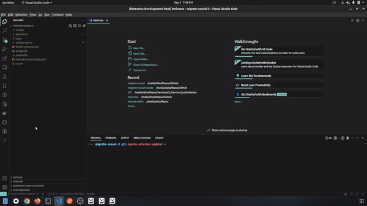

# migrate-consul-vscode README

This is an extension that is meant to be used with the [migrate-consul](https://www.npmjs.com/package/migrate-consul) npm package

It provides a sidebar to create migration files

## Features

Generate simple migration files with a button click



## Requirements

[typescript](https://www.npmjs.com/package/typescript) must be installed globally

[migrate-consul](https://www.npmjs.com/package/migrate-consul) must be installed globally

```bash
# with npm
npm i -g typescript
npm i -g migrate-consul

# with yarn
yarn global add typescript migrate-consul
```

## Known Issues

Only works when inside a migrate-consul project workspace. Run the command "Migrate Consul: New Project" in the Command Pallette or "migrate-consul init" from the CLI to create a new project if one does not already exist

## Release Notes

### 1.0.0

Allows creation of new migrations with key/value pre-filled from sidebar

Allows create of new projects from Command Pallette

Allows installation of migrate-consul from Command Pallette

### 1.0.3

Opens new migration file in editor when generated

---
